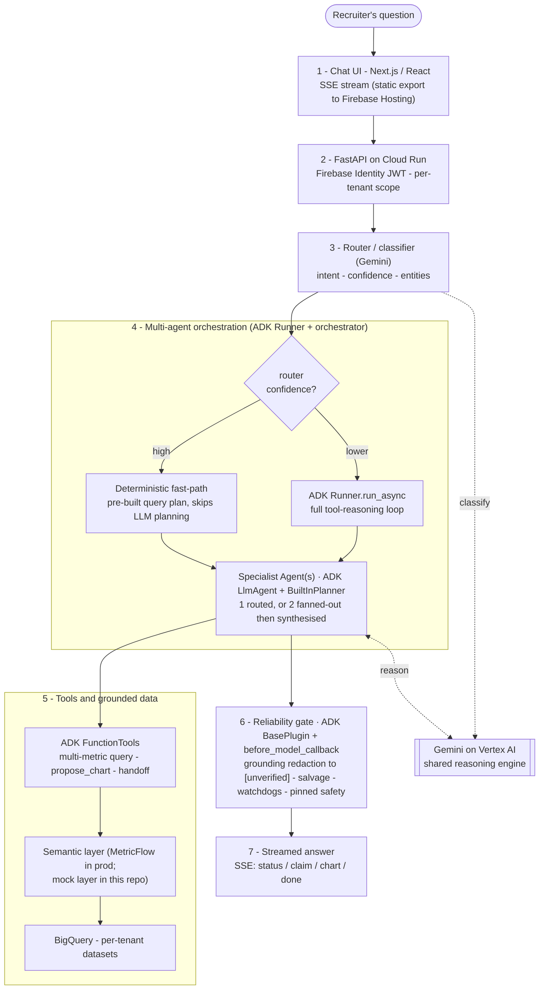
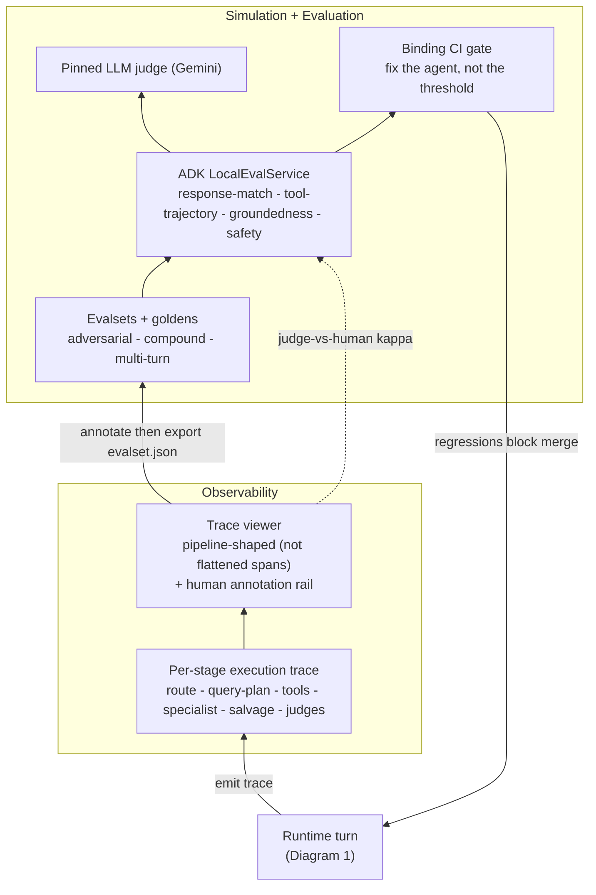

# Architecture

**TABI · ADK Recruitment Agents** · Google for Startups AI Agents Challenge 2026 · **Track 2: Optimize (Existing Agents)**

Two views tell the story: **(1)** the multi-agent request lifecycle — how a
recruiter's question becomes a grounded answer — and **(2)** the optimization
loop wrapped around it (Simulation · Evaluation · Observability) that hardens
the agent from sandbox to production-grade reliability.

---

## Diagram 1 — Multi-agent request lifecycle

A recruiter's question is authenticated and tenant-scoped (1–2), classified by a
Gemini router with a confidence score (3), then orchestrated (4) down one of two
lanes — a **deterministic fast-path** when confidence is high (skips LLM query
planning) or the **full ADK reasoning loop** otherwise — engaging **one
specialist or fanning out to two and synthesising**. Specialists call **ADK
FunctionTools** that resolve through the semantic layer to **per-tenant
BigQuery** (5), so every figure is grounded in real data. *(In this public repo,
the semantic layer is replaced with [`tools/mock_semantic_layer.py`](tools/mock_semantic_layer.py).)*
Before anything streams back, the **reliability gate** (6) runs grounding
redaction, salvage, watchdogs and pinned safety.

---

## Diagram 2 — Optimization loop (Simulation · Evaluation · Observability)

Every runtime turn emits a per-stage trace. A human annotates failures, which
**export to an ADK-canonical evalset** that — alongside the adversarial /
compound / multi-turn evalsets and goldens — drives **ADK's `LocalEvalService`**
with a **pinned** LLM judge. The **binding CI gate** blocks merges on
regressions, so fixes flow back into the agent — a closed loop that catches
quality regressions before they ship. *(The trace-viewer UI and the server-side
three-store projection are part of the private platform; this repo contains the
observability contract that defines the pipeline shape — span emission
[`core/spans.py`](core/spans.py), the panel model
[`core/trace_panels.py`](core/trace_panels.py), the span→`TurnTrace` projection
[`core/trace_projection.py`](core/trace_projection.py), and plugin wiring
[`core/session_plugins.py`](core/session_plugins.py).)*

---

## Technology stack

| Layer | TABI |
|---|---|
| **Intelligence** — Gemini / Vertex AI | Gemini on **Vertex AI**, per-agent model selection (Flash / Pro tiers); classifier on a Flash-Lite tier; eval judge **pinned** to `gemini-3-flash-preview` (`config/__init__.py`) |
| **Orchestration** — ADK | **Agent Development Kit**: `Agent`s, `Runner`, `App`, `SessionService`, `FunctionTool`s, `before_model_callback`, `BasePlugin` callbacks, `BuiltInPlanner`, `LocalEvalService` |
| **Infrastructure** — Google Cloud | **Cloud Run** (API), **Firebase Hosting** (static frontend), **BigQuery** + **Firestore** + **Cloud SQL** (data), **Vertex AI** (models) |

---

## Mapping to ADK core concepts

| ADK concept | Where it shows in this repo |
|---|---|
| `Agent` / `LlmAgent` | [`agents/`](agents/) — 7 specialist factories + `storytelling_agent.py` |
| `Runner.run_async` | the ADK reasoning-loop lane in [`core/orchestrator.py`](core/orchestrator.py) |
| `App` / `SessionService` | one cached `App` per agent; per-run sessions ([`core/app_factory.py`](core/app_factory.py)) |
| `FunctionTool` | [`tools/adk_tools.py`](tools/adk_tools.py) — hand-authored Gemini schemas |
| `before_model_callback` | structured-output injection ([`core/specialist_schema.py`](core/specialist_schema.py)) |
| `BasePlugin` error callbacks | salvage + guardrail plugins ([`core/salvage_plugin.py`](core/salvage_plugin.py), [`core/guardrail_plugin.py`](core/guardrail_plugin.py)) |
| `RunConfig` / `StreamingMode` / `max_llm_calls` | per-path caps in [`core/orchestrator.py`](core/orchestrator.py) |
| `BuiltInPlanner` / `ThinkingConfig` | per-agent thinking budgets ([`config/__init__.py`](config/__init__.py)) |
| `GenerateContentConfig` safety pinning | [`core/specialist_schema.py`](core/specialist_schema.py) + AST gate [`tests/test_safety_settings_pin.py`](tests/test_safety_settings_pin.py) |
| `LocalEvalService` + metric scorers | [`evaluation/adk_bridge.py`](evaluation/adk_bridge.py) |
| OpenTelemetry / `BigQueryAgentAnalyticsPlugin` | span emission [`core/spans.py`](core/spans.py); pipeline-shaped trace model [`core/trace_panels.py`](core/trace_panels.py) + projection [`core/trace_projection.py`](core/trace_projection.py); plugin wiring [`core/session_plugins.py`](core/session_plugins.py) |

> **Honesty note:** the "coordinator" is a Python `MultiAgentOrchestrator` + an
> LLM router, **not** an ADK `sub_agents` coordinator agent. It's a deliberate
> performance choice (deterministic fast-path + LLM hybrid).

---

## Component legend

- **Frontend** — Next.js 15 / React 19, static export → Firebase Hosting; SSE client. *(Not in this repo — agent optimization only.)*
- **API** — FastAPI on Cloud Run; streams SSE; Firebase Identity JWT; per-tenant scope. *(Not in this repo.)*
- **Router** — single Gemini structured-output classifier → `RouteResult(sub_intent, confidence, entities)` ([`core/router.py`](core/router.py)).
- **Orchestration** — `MultiAgentOrchestrator` + router drive ADK `Runner.run_async` over a cached `App` per agent; high-confidence sub-intents take the deterministic fast-path over pre-built query plans ([`core/query_plans.py`](core/query_plans.py)); compound questions fan out to two specialists and synthesise.
- **Specialists** — 7 routable `Agent`s + a `StorytellingAgent`, each with `BuiltInPlanner`/`ThinkingConfig`, a structured-output `before_model_callback`, and pinned safety config.
- **FunctionTools** — `query_multiple_recruitment_metrics` (parallel `asyncio.gather`), `propose_chart`, handoff → semantic layer → BigQuery (per-tenant).
- **Reliability gate** — grounding `ResponseValidator` redaction to `[unverified]`; `BasePlugin` salvage + tenant-scope guardrail plugins; layered watchdogs; 6-category `SAFETY_SETTINGS` pinned via one builder + an AST anti-drift CI gate.
