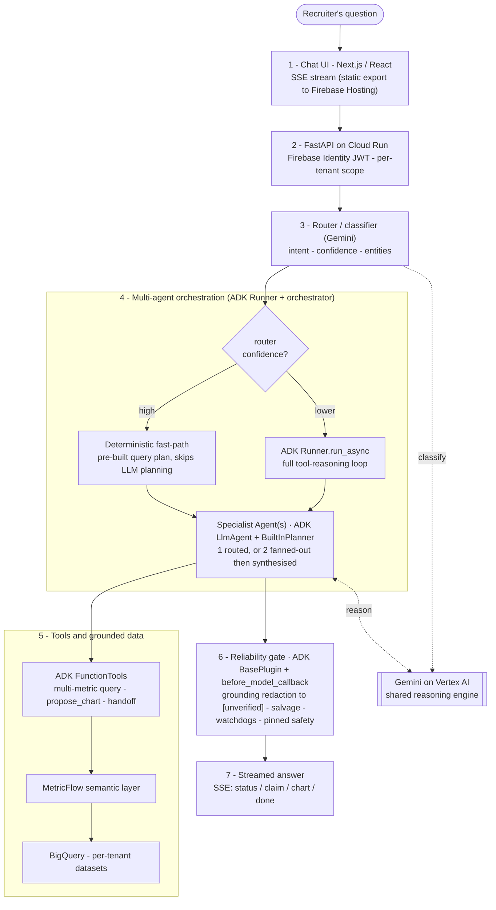
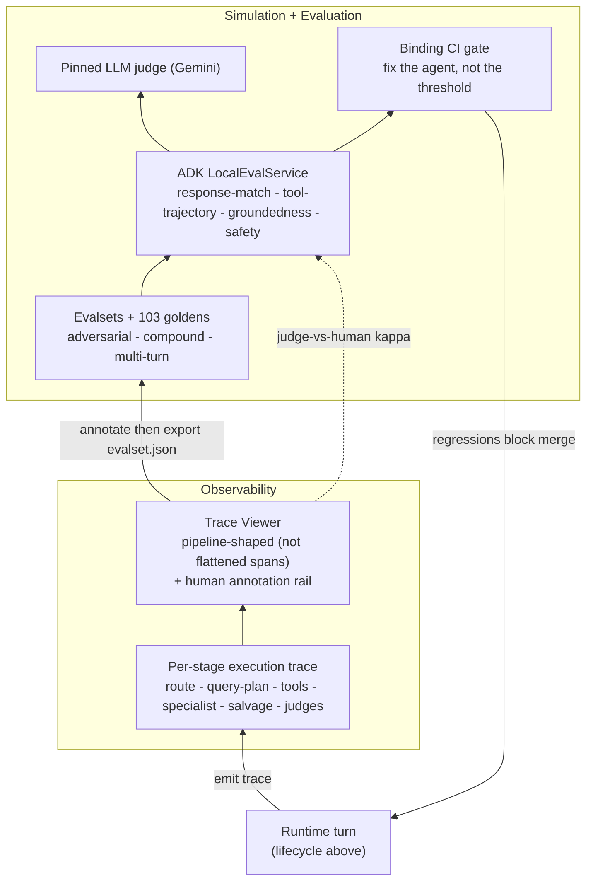

# TABI · ADK Recruitment Agents

**Google for Startups AI Agents Challenge 2026 — Track 2: Optimize (Existing Agents)**

TABI is a multi-agent recruitment-analytics platform. Talent leaders ask it questions in plain English, like *"Can we hit our Q2 engineering target?"* or *"Where's the bottleneck in our Data Engineer pipeline?"*, and it answers from their live ATS data.

Behind the chat, an LLM classifier router dispatches each question to one of 8 ADK agents: 7 routable specialists plus a storytelling agent. They query a MetricFlow semantic layer over real recruitment data and synthesise a grounded answer. The whole platform is built around one constraint: **it never reports an unverified figure as fact.** A leader sizing next quarter's hiring budget can't act on a confidently wrong number, so when a claim can't be backed by the data, TABI says so rather than guessing.

This repo is our **Track 2 entry**: the optimisation sprint that hardened TABI from sandbox to production-grade reliability. It contains the real ADK agent code wired to a deterministic mock semantic layer, plus the evaluation, observability, and simulation harnesses used to harden it.

---

## How TABI works

Two views: the **request lifecycle**, which shows how a question becomes a grounded answer, and the **optimization loop** wrapped around it that keeps the runtime reliable. The diagrams show the full production platform; this repo ships the ADK **agent layer** and the **optimization harnesses** (everything outside the MetricFlow / BigQuery / frontend boxes).

### Request lifecycle



A recruiter's question is authenticated and tenant-scoped, classified by a Gemini router with a confidence score, then orchestrated down one of two lanes: a **deterministic fast-path** when confidence is high (it skips LLM query planning), or the **full ADK reasoning loop** otherwise. Either lane engages one specialist, or fans out to two and synthesises their answers. Specialists call **ADK FunctionTools** that resolve through the MetricFlow semantic layer to per-tenant BigQuery, so every figure is grounded in real data. Before anything streams back, the **reliability gate** runs grounding redaction, salvage, watchdogs, and pinned safety.

### The optimization loop



Every runtime turn emits a per-stage trace rendered in a **pipeline-shaped trace viewer**, which shows the agent's reasoning in its own shape rather than as generic flattened spans. A human annotates failures, and the annotations export to an ADK-canonical evalset. Together with the adversarial, compound, and multi-turn evalsets and the 103 goldens, these drive ADK's `LocalEvalService` with a pinned LLM judge. A **binding CI gate** blocks merges on regressions, so every fix flows back into the agent rather than into a relaxed threshold. That closed loop is what moves an existing agent from sandbox to production-grade.

---

## Getting Started

No GCP credentials or proprietary data required — the agent and eval code run against a deterministic mock semantic layer:

```bash
# Requires Python 3.12+
python -m venv .venv && source .venv/bin/activate
pip install -r requirements.txt
pytest                                         # 57 passed, 5 skipped
python examples/demo_grounding_redaction.py    # 60s offline grounding-enforcement demo
```

Tools resolve through [`tools/mock_semantic_layer.py`](tools/mock_semantic_layer.py) instead of the proprietary MetricFlow/BigQuery layer. The 5 skipped tests are the live ADK-scorer gate, which drives the full chat pipeline (`AgentSession`, excluded from this repo) against Vertex AI — its wiring is preserved in [`evaluation/adk_bridge.py`](evaluation/adk_bridge.py), runnable only on the private platform.

---

## ADK Core Concepts → Code

| ADK Concept | TABI Implementation | Location |
|---|---|---|
| `Agent` | 8 specialist agents (7 routable + StorytellingAgent), per-agent model + thinking budgets | [`agents/`](agents/) |
| `Runner.run_async` | Funnelled through a cached `App` per agent | [`core/app_factory.py`](core/app_factory.py) |
| `SessionService` | Fresh `InMemorySessionService` per specialist (no cross-agent event contamination) | [`core/app_factory.py`](core/app_factory.py) |
| `FunctionTool` | Hand-authored Gemini schemas: `query_multiple_recruitment_metrics` (parallel `asyncio.gather`), `propose_chart`, handoff, planning-context | [`tools/adk_tools.py`](tools/adk_tools.py) |
| `before_model_callback` | Structured-output injection | [`core/specialist_schema.py`](core/specialist_schema.py) |
| `BasePlugin` callbacks | `on_model_error` / `on_tool_error` salvage + guardrail plugins | [`core/salvage_plugin.py`](core/salvage_plugin.py), [`core/guardrail_plugin.py`](core/guardrail_plugin.py) |
| `ReflectAndRetryToolPlugin` | ADK's tool-error reflection, ordered *before* salvage so recovered errors never flag `agent_error` | [`core/session_plugins.py`](core/session_plugins.py) |
| `GenerateContentConfig` | 6 pinned `SafetySetting`s via one builder + **AST anti-drift CI gate** | [`config/`](config/) |
| `RunConfig` / `max_llm_calls` | Per-path caps (single-pass 6, deterministic 5, orchestrator 5, goal-retry 4) vs. ADK's default of 500 | [`core/orchestrator.py`](core/orchestrator.py) |
| `BuiltInPlanner` / `ThinkingConfig` | Per-agent thinking budgets | [`agents/`](agents/) |
| `LocalEvalService` | ADK-native eval, 4 metric scorers: `final_response_match_v2` (0.6, **blocking**), `tool_trajectory_avg_score` (1.0, **blocking**), `hallucinations_v1` (0.6, advisory), `safety_v1` (0.8, advisory) | [`evaluation/`](evaluation/) |
| OpenTelemetry + `BigQueryAgentAnalyticsPlugin` | Manual spans for ADK-uninstrumented stages + pipeline-shaped trace projection | [`core/spans.py`](core/spans.py), [`core/trace_projection.py`](core/trace_projection.py) |

**Architecture note:** the coordinator is a Python `MultiAgentOrchestrator` + an LLM router, **not** an ADK `sub_agents` agent — a deliberate performance choice. High-confidence routes take a deterministic fast-path over pre-built query plans ([`core/query_plans.py`](core/query_plans.py)), skipping LLM query planning; ambiguous routes fall back to the full ADK reasoning loop.

---

## Evaluation, observability & simulation

### Agent Evaluation — binding CI gate

ADK-native `LocalEvalService` harness: **19 ADK cases across 5 evalsets**, plus a legacy 6-evaluator golden harness.

| Evalset | Cases | Coverage |
|---|---|---|
| `specialist_core` | 6 | 2 grounding, 1 PII-refusal, 3 adversarial prompt-injection |
| `compound_multi_agent` | 6 | Multi-specialist routing + synthesis |
| `narrative_chat` | 5 | Storytelling regression baselines |
| `multiturn_carryover` | 1 (2 turns) | Multi-turn entity inheritance |
| `goal_attainment_grounding` | 1 | Capacity-planning grounding |

The gate is **merge-blocking** ([`.github/workflows/analytics-eval.yml`](.github/workflows/analytics-eval.yml)): a regression in `final_response_match_v2` or `tool_trajectory_avg_score` blocks the PR. Discipline: *fix the agent, not the threshold.*

### Agent Observability — pipeline-shaped tracing

Generic tracers (Langfuse / Phoenix / Braintrust) flatten every decision — route vs. query-plan vs. salvage vs. narrative — into "just another LLM call." TABI's trace viewer renders each turn in the *pipeline's own shape* (`route → query-plan → tools → specialist → salvage → narrative → judges`) with a human annotation rail beside the judge scores. This repo ships the observability **contract** as runnable, tested code:

| Layer | What | Location |
|---|---|---|
| **Emit** | Manual OTel spans for stages ADK doesn't instrument (turn root, router, query, metrics-plan, salvage, narrative) | [`core/spans.py`](core/spans.py) |
| **Model** | Pipeline-shaped panel model (`RoutePanel` w/ confidence, `QueryPlanPanel`, `ToolCall`, `SalvagePanel`, `SpanNode` tree) | [`core/trace_panels.py`](core/trace_panels.py) |
| **Project** | Span-tree → `TurnTrace` projection, degrade-isolated (missing span ⇒ empty panel, never a crash) | [`core/trace_projection.py`](core/trace_projection.py) |

Underneath: OpenTelemetry → Cloud Trace + the ADK `BigQueryAgentAnalyticsPlugin` (flag-gated). The viewer UI and the server-side three-store projection are part of the private platform; what ships here is the emission + model + projection that define the shape.

### Agent Simulation — synthetic edge cases

Adversarial and compound evalsets act as edge cases: prompt injection, fake system-role markers, multi-specialist handoff, and multi-turn carryover. **103 hand-authored goldens** (35 routing, 10 multi-agent, 18 factuality, 15 tool-usage, 10 safety, 15 multi-turn), count-pinned by [`tests/test_golden_dataset.py`](tests/test_golden_dataset.py).

---

## Technology stack

| Layer | TABI Implementation |
|---|---|
| **Intelligence** | Gemini on Vertex AI — per-agent model selection (Flash / Pro); eval judge pinned to `gemini-3-flash-preview` |
| **Orchestration** | ADK: Agents, Runner, App, SessionService, FunctionTools, `before_model_callback`, `BasePlugin` callbacks, `LocalEvalService` |
| **Infrastructure** | Cloud Run (API), Firebase Hosting (frontend), BigQuery + Firestore + Cloud SQL (data), Vertex AI (models) |

---

## Repository Structure

| Path | What's inside |
|---|---|
| [`agents/`](agents/) | 8 specialist agent factories (7 routable + StorytellingAgent) with v3.1 prompts |
| [`core/`](core/) | Orchestration, grounding, plugins, and the trace model (breakdown below) |
| [`tools/`](tools/) | FunctionTool definitions, backed by [`mock_semantic_layer.py`](tools/mock_semantic_layer.py) |
| [`models/`](models/) | Pydantic planning-context models shared by tools, verifier, and query plans |
| [`config/`](config/) | Model tiering, pinned safety settings, generation config |
| [`evaluation/`](evaluation/) | ADK eval harness: [`adk_bridge.py`](evaluation/adk_bridge.py), 5 evalsets, 103 goldens |
| [`examples/`](examples/) | Offline grounding-redaction demo |
| [`tests/`](tests/) | Grounding, safety AST gate, trace projection, query plans, eval, goldens |
| [`.github/workflows/`](.github/workflows/) | [`analytics-eval.yml`](.github/workflows/analytics-eval.yml), the merge-blocking eval gate |

`core/` is the dense one. By concern:

| Concern | Files |
|---|---|
| Routing + deterministic fast-path | [`router.py`](core/router.py) · [`orchestrator.py`](core/orchestrator.py) · [`query_plans.py`](core/query_plans.py) |
| Grounding enforcement | [`response_validator.py`](core/response_validator.py) · [`grounding_enforcement.py`](core/grounding_enforcement.py) |
| Capacity verify, critique, retry | [`goal_attainment_retry.py`](core/goal_attainment_retry.py) |
| ADK BasePlugins | [`salvage_plugin.py`](core/salvage_plugin.py) · [`guardrail_plugin.py`](core/guardrail_plugin.py) · [`session_plugins.py`](core/session_plugins.py) |
| Observability contract | [`spans.py`](core/spans.py) · [`trace_panels.py`](core/trace_panels.py) · [`trace_projection.py`](core/trace_projection.py) |

---

## What's Not Included (proprietary IP)

A curated harness, not the full platform. Excluded and backed by `mock_semantic_layer.py`:

- **MetricFlow semantic layer** — 50+ metric definitions, the core analytical differentiation
- **Greenhouse ATS integration** — ingestion, codegen, API client
- **dbt transform models** and **multi-tenant provisioning** (IAM, Terraform)
- **Production query plans** — the tuned metric-to-query mappings (a genericized subset ships in [`core/query_plans.py`](core/query_plans.py))
- **Frontend** — the Next.js web application

---

**TABI** — building the AI analyst hiring teams deserve. Based in London (EMEA).

*Google for Startups AI Agents Challenge 2026 · Track 2: Optimize (Existing Agents)*

> Source-available, evaluation use only — see [`LICENSE`](LICENSE).
